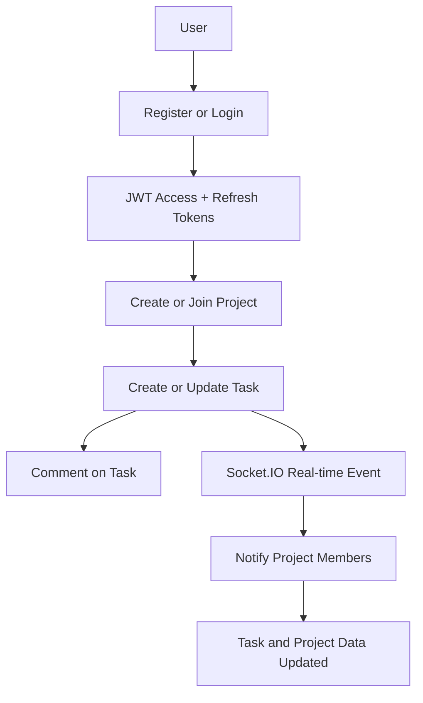

# CollabFlow

CollabFlow is a real-time task management backend built with Node.js, Express, TypeScript, Prisma, PostgreSQL, JWT authentication, and Socket.IO.

## Features

- User authentication with register, login, logout, and refresh tokens
- User profile management
- Project and team membership management
- Task CRUD with status, priority, due dates, and assignees
- Task comments
- Real-time updates for task and project events through Socket.IO

## Tech Stack

- Backend: Node.js, Express, TypeScript
- Database: PostgreSQL with Prisma ORM
- Authentication: JWT with refresh tokens
- Validation: Zod
- Real-time: Socket.IO
- Environment handling: dotenv
- Password hashing: bcryptjs

## Project Structure

- src/controllers: Request handlers
- src/services: Business logic
- src/routes: API routes
- src/middleware: Authentication, validation, and error handling
- src/utils: JWT helpers and Socket utilities
- prisma: Prisma schema and migrations

## Installation

1. Clone the repository
2. Install dependencies

```bash
npm install
```

3. Create a PostgreSQL database and update the environment variables in the .env file

4. Generate the Prisma client and run migrations

```bash
npx prisma generate
npx prisma migrate dev --name init
```

5. Start the development server

```bash
npm run dev
```

## Environment Variables

Create a .env file using the example file as a reference:

```bash
cp .env.example .env
```

Required variables include:

- DATABASE_URL
- JWT_ACCESS_SECRET
- JWT_REFRESH_SECRET
- PORT

## API Overview

### Authentication

- POST /api/auth/register
- POST /api/auth/login
- POST /api/auth/logout
- POST /api/auth/refresh
- GET /api/auth/me
- PATCH /api/auth/me

### Projects

- GET /api/projects
- POST /api/projects
- GET /api/projects/:projectId
- PATCH /api/projects/:projectId
- DELETE /api/projects/:projectId
- POST /api/projects/:projectId/invite

### Tasks

- GET /api/tasks
- POST /api/tasks
- GET /api/tasks/:taskId
- PATCH /api/tasks/:taskId
- DELETE /api/tasks/:taskId
- POST /api/tasks/:taskId/comments

## Flowchart



## Notes

The current implementation provides the backend foundation for a production-ready collaboration workflow. It is structured to support future expansion such as role-based permissions, notifications, file attachments, and a frontend client.
